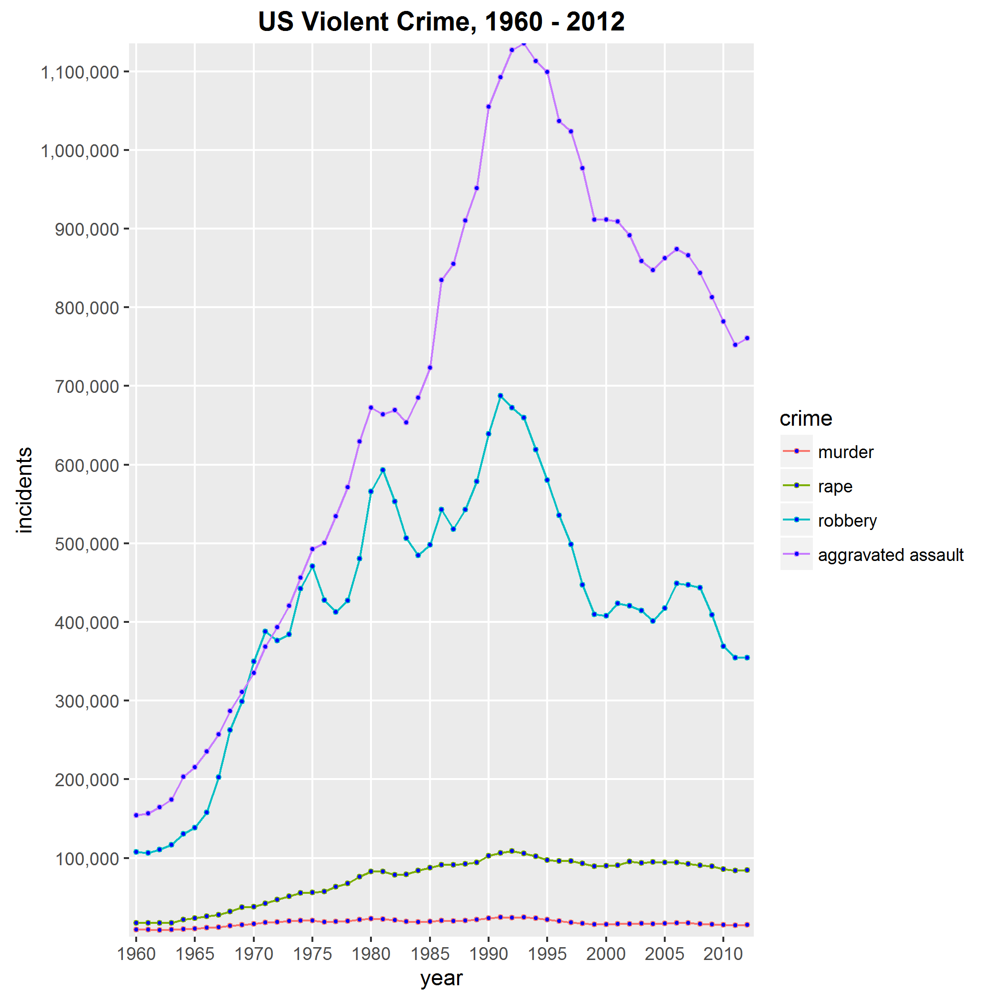

## Another day another horrible headline

 <br/>

[Reich charged with murder in Scarsdale stabbing](https://www.google.com/url?sa=t&rct=j&q=&esrc=s&source=web&cd=6&cad=rja&uact=8&ved=0ahUKEwjnjqjTtMHKAhXkvIMKHbVLAiEQFggyMAU&url=http%3A%2F%2Fwww.lohud.com%2Fstory%2Fnews%2Fcrime%2F2016%2F01%2F21%2Fscarsdale-murder-funeral%2F79108022%2F&usg=AFQjCNHQ6AH_LJnPSl9oDb4-g_V25N_vGw&sig2=mz5RcPEClyYAHv2n1EzzJw&bvm=bv.112454388,d.amc)<br/>
[Geneseo seeks stability in wake of apparent murder-suicide](https://www.google.com/url?sa=t&rct=j&q=&esrc=s&source=web&cd=4&cad=rja&uact=8&ved=0ahUKEwjnjqjTtMHKAhXkvIMKHbVLAiEQFgglMAM&url=http%3A%2F%2Fwww.democratandchronicle.com%2Fstory%2Fnews%2F2016%2F01%2F18%2Fpolice-give-update-geneseo-triple-homicide%2F78964832%2F&usg=AFQjCNH1nD9X1JFUuHZant5QBULfcwVGnw&sig2=dtycsDy5ZxH8n2zVN02e2Q&bvm=bv.112454388,d.amc)<br/>
[Woman convicted of fatal stabbing and robbery in Whittier](http://homicide.latimes.com/post/woman-convicted-fatal-stabbing-and-robbery-whittier/)<br/>
[Texas man pleads not guilty to murdering wife more than 40 years ago](http://www.foxnews.com/us/2016/01/22/texas-man-pleads-not-guilty-in-wife-killing-in-173.html)<br/>
[MURDER TOWN USA (AKA WILMINGTON, DELAWARE)](http://www.newsweek.com/2014/12/19/wilmington-delaware-murder-crime-290232.html)<br/>
[Armed man killed at police station year after Paris attacks](http://www.cbsnews.com/news/paris-police-station-attack-man-with-knife-shot-dead-officials-say/)<br/>
[Terrorism Charges in Bangladesh for 14 Men Deported From Singapore](http://www.nytimes.com/2016/01/24/world/asia/terrorism-bangladesh-singapore.html?_r=0)<br/>

<br/>

<div class="explainer">
    Note: Links on the Internet may change so not all of the above may still be active.
</div>

<div class="pic_credit">
Image obtained from Polyvore.com. Credit FOTKI.YANDEX.RU.
</div>


---

## Wait! Is there really that much crime?

* The FBI keeps track of violent crime in the U.S.
* The data are public.
* So we downloaded the data for the most violent crimes (murder, rape, robbery and aggravated assault) for most of the past 50 years and graphed it to see what's what. See?

<div class="plotter">
    
</div>


---

## But is that the whole story?

<div class="emphatic">
If we look only at one crime - murder - the picture looks noticeably different, though, doesn't it?
</div>

```{r, echo=TRUE, fig.width=7, fig.height=5, fig.align='center'}
    library(ggplot2); library(scales)
    csv <- read.csv("working_files/CrimeTotal.csv", header=FALSE, skip=6)
    c2 <- csv[1:53,c(1, 4)]
    colnames(c2) <- c("year", "murders")
    c2$year <- as.factor(c2$year)
    years <- seq(1960, 2012, 5)
    ggplot(data=c2, aes(x=year, y=murders, group=1)) + geom_point() + geom_line(size=1, aes(col=murders)) + geom_smooth() +
    scale_x_discrete(name="year", breaks = years, labels=as.character(years))

```
    

---

## Look closer at the data

* The initial plot makes it look like aggravated assault rules and murder and rape are insignificant. 
* The second plot shows that this was at least partly an illusion, created by the differing scales of the different crimes.
* So if you want to get a better understanding of violence in America the last many years, what do you do?

<div class="sellit">
<p>Head on over to <a href="https://dpirv.shinyapps.io/dp_project/">Project Part 1</a></p>
<p class="simple_ital">(The first part of this two-part project for the Coursera Developing Data Products class)</p>
    <p>There you will find an interactive application that will allow you to explore the raw numbers on violent crime, state by state, one type of crime at a time or all at once.</p>
</div>

<div class="finl">See. Explore. Learn.</div>

<div class="exeunt">
    Thanks for playing!
</div>


